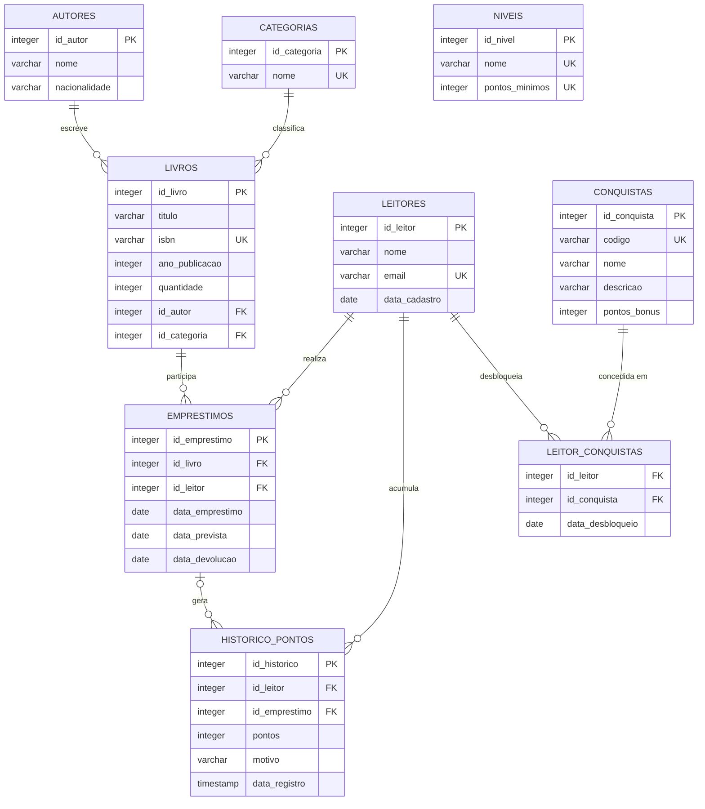

# Sistema de Biblioteca - PostgreSQL

## 1. Apresentação do projeto

### Tema
Sistema de gerenciamento de uma biblioteca.

### Objetivo geral
Criar um banco de dados relacional em PostgreSQL capaz de armazenar autores, categorias, livros, leitores e empréstimos, mantendo os relacionamentos e as regras de integridade entre os dados.

### Público-alvo
Bibliotecas escolares, pequenas bibliotecas comunitárias e estudantes que precisam de um exemplo prático de banco de dados relacional.

## 2. Modelo de dados

O sistema possui as seguintes entidades:

- **autores**: cadastro dos autores dos livros.
- **categorias**: categorias/gêneros dos livros.
- **livros**: catálogo de livros.
- **leitores**: pessoas cadastradas para realizar empréstimos.
- **emprestimos**: registros de empréstimos e devoluções.

### Relacionamentos

- Um autor pode possuir vários livros.
- Uma categoria pode possuir vários livros.
- Um leitor pode realizar vários empréstimos.
- Um livro pode aparecer em vários empréstimos ao longo do tempo.



> `NIVEIS` não aparece ligada por chave estrangeira no diagrama de propósito: o nível de um leitor não é armazenado, ele é **calculado** comparando a soma de `historico_pontos.pontos` do leitor com `niveis.pontos_minimos` (veja a seção 10). Isso evita guardar um dado derivado que poderia ficar desatualizado.

## 3. Regras de integridade

- Todas as tabelas possuem chave primária.
- Campos obrigatórios utilizam `NOT NULL`.
- `email`, `isbn` e nome de categoria utilizam `UNIQUE` quando necessário.
- Os relacionamentos são garantidos por chaves estrangeiras (`FOREIGN KEY`).
- A quantidade de exemplares não pode ser negativa.
- O ano de publicação deve estar entre 0 e o ano atual.
- A data prevista de devolução não pode ser anterior à data do empréstimo.
- A data de devolução não pode ser anterior à data do empréstimo.

## 4. Estrutura do projeto

```text
projeto_biblioteca_postgresql/
├── README.md
├── scripts/
│   ├── 01_create_table_autores.sql
│   ├── 01_create_table_categorias.sql
│   ├── 01_create_table_livros.sql
│   ├── 01_create_table_leitores.sql
│   ├── 01_create_table_emprestimos.sql
│   ├── 02_insert_into_autores.sql
│   ├── 02_insert_into_categorias.sql
│   ├── 02_insert_into_livros.sql
│   ├── 02_insert_into_leitores.sql
│   ├── 02_insert_into_emprestimos.sql
│   ├── 03_update_livros.sql
│   ├── 04_delete_leitor.sql
│   ├── 05_create_table_niveis.sql               # gamificação
│   ├── 05_create_table_conquistas.sql           # gamificação
│   ├── 05_create_table_historico_pontos.sql     # gamificação
│   ├── 05_create_table_leitor_conquistas.sql    # gamificação
│   ├── 06_insert_into_niveis.sql                # gamificação
│   ├── 06_insert_into_conquistas.sql            # gamificação
│   ├── 07_insert_into_emprestimos_gamificacao.sql  # gamificação (dados de demo)
│   ├── 08_insert_into_historico_pontos.sql      # gamificação (calcula pontos)
│   ├── 09_insert_into_leitor_conquistas.sql     # gamificação (calcula conquistas)
│   ├── 10_insert_into_historico_pontos_bonus.sql # gamificação (bônus de conquista)
│   └── 11_consultas_gamificacao.sql             # gamificação (ranking, progresso, etc.)
└── prototipo/            # protótipo visual da tela "Meu Perfil" (sem backend)
    ├── index.html
    ├── style.css
    └── script.js
```

## 5. Ordem de execução

Execute os scripts na seguinte ordem:

1. Criação das tabelas de autores e categorias.
2. Criação de livros e leitores.
3. Criação de empréstimos.
4. Inserts de autores e categorias.
5. Inserts de livros e leitores.
6. Inserts de empréstimos.
7. UPDATE.
8. DELETE.
9. Criação das tabelas de gamificação (`05_create_table_*.sql`).
10. Inserts de níveis e conquistas (`06_insert_into_*.sql`).
11. Empréstimos extras de demonstração (`07_insert_into_emprestimos_gamificacao.sql`).
12. Cálculo dos pontos (`08_insert_into_historico_pontos.sql`).
13. Cálculo das conquistas desbloqueadas (`09_insert_into_leitor_conquistas.sql`).
14. Cálculo do bônus de pontos das conquistas (`10_insert_into_historico_pontos_bonus.sql`).

A ordem evita erros de chave estrangeira. Os scripts 08 a 10 dependem dos dados de `emprestimos`, por isso vêm depois de todos os inserts de empréstimos.

## 6. Como executar

### Opção recomendada: pgAdmin 4

1. Instale PostgreSQL para Windows. O instalador oficial inclui o PostgreSQL Server e o pgAdmin.
2. Abra o pgAdmin 4.
3. Conecte-se ao servidor PostgreSQL usando a senha definida na instalação.
4. Crie um banco chamado `biblioteca`.
5. Abra o **Query Tool**.
6. Abra cada arquivo `.sql` da pasta `scripts`.
7. Execute usando o botão ▶ ou F5.
8. Confira as tabelas em `Databases > biblioteca > Schemas > public > Tables`.

### Observação sobre execução múltipla

Os scripts de criação utilizam `CREATE TABLE IF NOT EXISTS` e os inserts utilizam `ON CONFLICT DO NOTHING`, permitindo repetir a maior parte da execução sem criar duplicidades ou gerar erro de chave única.

## 7. Validação

Depois dos scripts, algumas consultas úteis são:

```sql
SELECT * FROM autores;
SELECT * FROM categorias;
SELECT * FROM livros;
SELECT * FROM leitores;
SELECT * FROM emprestimos;
```

Para visualizar os empréstimos com nomes:

```sql
SELECT
    e.id_emprestimo,
    l.titulo AS livro,
    le.nome AS leitor,
    e.data_emprestimo,
    e.data_prevista,
    e.data_devolucao
FROM emprestimos e
JOIN livros l ON l.id_livro = e.id_livro
JOIN leitores le ON le.id_leitor = e.id_leitor
ORDER BY e.id_emprestimo;
```

## 8. Gamificação

### Por que gamificação

A biblioteca já tem leitores, livros e um histórico de empréstimos — dados suficientes
para reconhecer o comportamento de quem usa o sistema com frequência, sem precisar de
nenhuma entidade nova de "usuário" ou "livro". A gamificação foi escolhida porque se
encaixa naturalmente nesse fluxo já existente:

```text
Leitor → realiza empréstimos/devoluções → recebe pontos → sobe de nível
       → desbloqueia conquistas → aparece no ranking
```

### Como funciona

Nenhuma tabela existente (`autores`, `categorias`, `livros`, `leitores`, `emprestimos`)
foi alterada. Foram adicionadas 4 tabelas nas quais a gamificação se apoia:

| Tabela | Para que serve |
|---|---|
| `niveis` | catálogo de níveis e a pontuação mínima de cada um |
| `conquistas` | catálogo de conquistas possíveis |
| `historico_pontos` | cada linha de pontos ganhos por um leitor e o motivo (referencia `leitores` e, quando aplicável, `emprestimos`) |
| `leitor_conquistas` | associação N:N entre `leitores` e `conquistas` desbloqueadas |

### Pontos

Como o modelo atual só tem empréstimo/devolução (não existe reserva), a regra usa
apenas o que já existe:

| Ação | Pontos |
|---|---|
| Empréstimo realizado | +10 |
| Devolução dentro do prazo | +20 |

Os pontos **não são digitados manualmente**: o script `08_insert_into_historico_pontos.sql`
lê a tabela `emprestimos` e gera as linhas de `historico_pontos` automaticamente
(é idempotente, pode ser reexecutado sem duplicar).

### Níveis

O nível de um leitor **não é uma coluna armazenada** — ele é sempre calculado somando
`historico_pontos.pontos` do leitor e comparando com `niveis.pontos_minimos`. As faixas
abaixo foram escolhidas para caber no volume de dados de demonstração do projeto:

| Nível | Nome | Pontos mínimos |
|---|---|---|
| 1 | Leitor Iniciante | 0 |
| 2 | Leitor Frequente | 30 |
| 3 | Leitor Assíduo | 60 |
| 4 | Leitor Dedicado | 90 |
| 5 | Leitor Expert | 120 |

### Conquistas

| Conquista | Requisito | Bônus |
|---|---|---|
| Primeiro Empréstimo | 1º empréstimo do leitor | — |
| Primeira Devolução | 1ª devolução dentro do prazo | — |
| Leitor Frequente | atingir a pontuação do nível "Leitor Frequente" | — |
| 5 Livros Lidos | 5 empréstimos com devolução registrada | +25 |
| 10 Livros Lidos | 10 empréstimos com devolução registrada | +50 |
| Explorador de Categorias | livros de 3 categorias diferentes | +15 |

As conquistas também são calculadas por SQL a partir de `emprestimos`/`historico_pontos`
(`09_insert_into_leitor_conquistas.sql`); os pontos de bônus são aplicados depois, em
`10_insert_into_historico_pontos_bonus.sql`.

### Ranking

Calculado com `RANK()` do PostgreSQL sobre a soma de `historico_pontos` de cada leitor
(script `11_consultas_gamificacao.sql`), não é uma lista escrita manualmente.

### Protótipo

A pasta `prototipo/` contém uma tela "Meu Perfil" (HTML/CSS/JS puro, sem dependências
externas) mostrando pontos, nível, progresso, conquistas e ranking. **É um protótipo
visual com dados de exemplo, sem conexão real com o PostgreSQL.**

## 9. GitHub

O repositório sugerido é:

`projeto-biblioteca-postgresql`

O `README.md` é o arquivo de apresentação do projeto. Ele **não é o nome do repositório**.

O repositório deve conter o README, a pasta `scripts` e a pasta `prototipo`.

## 10. Autor

Projeto acadêmico desenvolvido para a atividade de banco de dados PostgreSQL.
